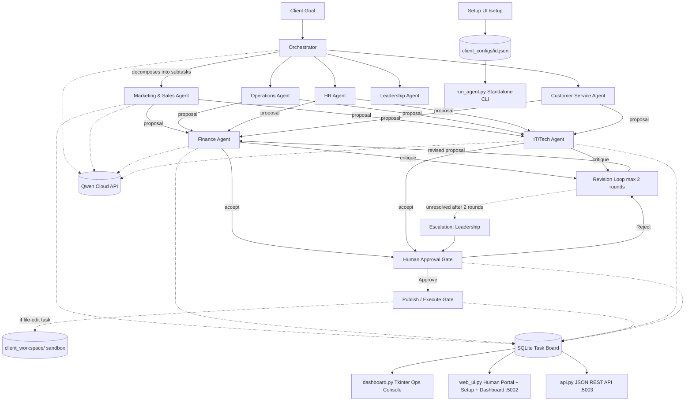

# Graub AI
### A Multi-Agent Business Society for SMEs — Qwen Cloud Global AI Hackathon, Track 3: Agent Society

Graub AI is an agency of specialist AI agents that run the seven core functions of a small business — Marketing & Sales, Finance, IT/Technology, Operations, HR, Customer Service, and Leadership. Each agent is a junior-level assistant to a human expert in that domain: it drafts, reviews, and handles the repetitive day-to-day work, but every consequential action still passes through a human before it's approved, and a further separate human step before it's published/executed. Agents negotiate with each other through bounded rounds when they disagree, and escalate to a human Leadership authority when they can't resolve it themselves.

## Why Track 3

Graub AI's value is specifically in how the agents divide labor and disagree with each other — not in one agent autonomously finishing a task end to end. The Orchestrator decomposes goals across seven distinct specialist agents; Finance and IT independently audit every proposal against hard, programmatically-enforced constraints; agents negotiate through up to two bounded rounds; and unresolved conflicts escalate to a human Leadership authority. A working single-agent baseline (`baseline_single_agent.py`) is run against identical scenarios to measure the actual efficiency gain — see `run_comparison.py`.

## Architecture



Four different surfaces read/write the same live SQLite ledger and client config, each aimed at a different audience:
- **`dashboard.py`** — native Tkinter desktop app. The business owner's "whole system at a glance" ops console.
- **`web_ui.py`** (port 5002) — the human-facing product surface. `/setup` for onboarding and agent selection, `/dashboard` for the aggregate KPI view, `/agent/<domain>` for each expert's own scoped approval queue + WhatsApp-style chat + (for IT_Tech) sandboxed file-edit requests.
- **`api.py`** (port 5003) — a JSON REST API so other software can call a single agent directly, independent of the full negotiation pipeline. This is the concrete foundation for a SaaS integration story.
- **`run_agent.py`** — CLI entrypoint to run any one agent standalone (`python run_agent.py --agent Finance --task "..."`), proving each agent is a self-contained assistant, not a piece that only works inside the full pipeline.

## Agent Roster

| Agent | Role | Reports To | Hard Constraint Enforced |
|---|---|---|---|
| Orchestrator | Decomposes goals into subtasks, assigns to domains | — | — |
| Marketing & Sales | Drafts campaigns, pricing, funnels | Human Marketing lead | — |
| Finance | Audits every proposal for budget compliance | Human Finance lead | Budget ceiling |
| IT/Tech | Audits technical feasibility; drafts sandboxed file edits | Human IT lead | Max deployments/landing pages |
| Operations | Drafts logistics, staffing, timelines | Human Operations lead | Max staff, min setup days |
| HR | Drafts hiring, policy, compliance actions | Human HR lead | Labor compliance |
| Customer Service | Drafts support workflows | Human CS lead | SLA response window |
| Leadership | Arbitrates conflicts other agents can't resolve | Human business owner | — |

All agent names, enabled/disabled status, and permissions are per-client, set via `/setup` in the browser or the `onboarding.py` CLI wizard — nothing is hardcoded to one business. Every agent's own system prompt explicitly frames it as a junior assistant to its human counterpart, following the same hierarchy a real business would.

**Reviewers vs. proposers:** Finance and IT_Tech never get a task directly assigned to them — they review every proposal from the other five agents inline, as part of the negotiation pipeline itself, not something a human triggers. So their portal (`/agent/Finance`, `/agent/IT_Tech`) won't show a "Pending Approvals" queue the way Marketing_Sales's does — instead it shows a **Review Activity** feed: every verdict (accept/critique) they've actually issued, pulled straight from the audit log. That's where their work is visible.

## Individually Deployable Agents

Every agent works three different ways, deliberately:
1. **Inside the full pipeline** (`main.py`) — the negotiation/escalation story for the demo.
2. **Standalone via CLI** (`run_agent.py`) — `python run_agent.py --agent HR --task "Draft a job posting for a part-time support role"` runs just that one agent, respecting its configured permissions, with no orchestrator or negotiation involved.
3. **Standalone via JSON API** (`api.py`) — `POST /api/v1/agents/HR/task` does the same thing over HTTP, for any external system to call.

An agent that isn't enabled in a client's config (`client_configs/<id>.json`) refuses to run in all three surfaces — this is what "a client only pays for the agents they select" is built on.

## Agent Selection & Subscription Tiers (data model built now; billing is post-hackathon)

`client_config.py` defines `SUBSCRIPTION_TIERS` (Starter / Growth / Full Agency), each pre-selecting a recommended set of enabled agents. Choosing a tier in `/setup` or `onboarding.py` toggles which agents are enabled — this is real and enforced (a disabled agent refuses to run anywhere in the system). What's **not** wired yet is actual payment: there's no Stripe/payment integration, and tier selection doesn't currently gate anything beyond which agents are turned on. That's intentional scope for this build window — see Roadmap below.

## Sandboxed File Edits (the scoped version of "let agents edit files")

IT_Tech can draft a file edit (`/agent/IT_Tech` → "Request a File Edit"), but three things are true no matter what:
1. **Every path is confined to `client_workspace/<something>/`** — `file_tools.py` resolves and rejects any path that would escape that folder (blocks `../` traversal, absolute paths, etc.) before an agent ever sees it.
2. **Drafting never writes to disk.** `propose_file_edit` only stores the proposed new content on the task board.
3. **Writing only happens on publish** — `apply_file_edit` is called from exactly one place, `web_ui.py`'s `/publish` route, after a human has both approved and published that specific task. This reuses the exact same approve → publish pattern as every other proposal in the system, so file edits are governed identically to a marketing campaign or a hiring plan.

Unrestricted access to files anywhere on a client's actual laptop is a materially different (and much larger) engineering and security undertaking — see Roadmap.

## Business Memory — How Agents "Learn" Over Time

To be precise about what this actually is: there's no model fine-tuning happening — that's a separate, much larger undertaking than this hackathon window. What's real is the standard pattern for LLM agent memory: **persistent, growing context that gets fed back into every future prompt**, implemented in `business_memory.py`.

1. **Observations (automatic, free)** — every time a task is fully resolved (approved, rejected, or published), one line gets recorded: what happened, to which domain, with what outcome. No LLM call.
2. **Insights (periodic, one LLM call)** — every `CONSOLIDATE_EVERY_N_TASKS` (default 5) resolved tasks, Qwen is asked once to distill recent raw observations — merged with prior insights — into a handful of durable, reusable lessons. This is what keeps memory compact even after hundreds of tasks, instead of prompts growing forever.
3. **Injection** — every agent's system prompt (Marketing, Finance, IT_Tech, and the base-class agents) now includes a "Business Memory" block pulled from `get_memory_context()` before it drafts or reviews anything, so its output is actually informed by what's happened before, not just the task in front of it.
4. **Predictions (on-demand)** — `/insights` in the web portal has a "Generate Predictions Now" button, which asks Qwen to turn accumulated memory into forward-looking suggestions for the human owner. This is explicitly human-triggered, not automatic, so it doesn't burn API calls on its own.

This is genuinely cumulative — the more tasks that run, the more memory accumulates, the more informed every future proposal and review becomes. That's the "growth" the agents actually do.

## Governance Rules

1. **Human-in-the-loop is non-negotiable** for anything with real-world effect. Approval and publish/execution are two separate, explicitly logged steps.
2. **No agent acts outside its domain.** Marketing cannot approve its own budget; only Finance can.
3. **Full auditability.** Every proposal, critique, revision, human decision, and publish action is timestamped and logged to `agent_society.db`.
4. **Bounded negotiation.** Agents get a maximum of 2 rounds to resolve a critique before the task escalates.
5. **Escalation chain.** Unresolved conflicts are mirrored into the Leadership agent's queue for human arbitration.
6. **No duplicate agent names**, enforced at onboarding and in `/setup`.
7. **File edits are sandboxed and human-gated**, identically to every other proposal type.

## Setup

1. Clone the repo and create a virtual environment:
   ```bash
   python -m venv .venv
   source .venv/bin/activate   # Windows: .venv\Scripts\activate
   pip install -r requirements.txt
   ```
2. Add your Qwen Cloud / DashScope key to a `.env` file:
   ```
   DASHSCOPE_API_KEY=sk-xxxxxxxx
   ```
3. **Verify connectivity before anything else** — this costs one small API call instead of debugging through a full pipeline run:
   ```bash
   python test_connection.py
   ```
4. Onboard a client — either the CLI wizard, or run `web_ui.py` (next step) and use `/setup` in the browser:
   ```bash
   python onboarding.py
   ```
5. Run the human-facing web portal:
   ```bash
   python web_ui.py
   ```
   Visit `http://localhost:5002/` for the home page, `/setup` to configure, `/dashboard` for the aggregate view, `/agent/Marketing_Sales` (swap for any domain) for that expert's queue.
6. Run the multi-agent negotiation pipeline (in a separate terminal):
   ```bash
   python main.py --client graub_ai --goal "Launch a small promotional campaign next month."
   ```
   It will pause and wait for you to approve/publish tasks from the web portal.
7. Optionally, watch the live desktop ops console:
   ```bash
   python dashboard.py
   ```
8. Optionally, run the JSON API (separate terminal):
   ```bash
   python api.py
   ```
9. Try a single agent standalone:
   ```bash
   python run_agent.py --agent Finance --task "Review this: $2000 ad spend on Google Ads for a spring sale"
   ```
10. Run the baseline vs multi-agent comparison across all scenarios, for your submission numbers:
    ```bash
    python run_comparison.py --client graub_ai
    python evaluate_metrics.py
    ```

## Network Troubleshooting

If `test_connection.py` fails, the error message tells you which of two things happened:

- **DNS resolution failure** (`getaddrinfo failed`) — the address itself couldn't be found. Check `config.py` still points at `https://dashscope-intl.aliyuncs.com/compatible-mode/v1` and hasn't been reverted.
- **Read timeout** (`Read timed out`) — the connection actually reached the server, but no response came back in time. This is a network-path issue, not a code issue: something between your machine and Alibaba's servers is slow, throttling, or silently dropping traffic (common with certain ISPs' international routing, VPNs, or antivirus HTTPS inspection).

For a timeout, run the layered diagnostic — it checks DNS, raw TCP, TLS, and the actual HTTP request as four separate steps, so you can see exactly which one is failing instead of one opaque error:
```bash
python network_diagnostic.py
```
Each failing step prints a specific, targeted explanation and next action. In short: TCP-level failure → try a VPN through a different region; TLS-level failure → check antivirus HTTPS/SSL scanning; everything passes but `qwen_request` still times out → raise `QWEN_REQUEST_TIMEOUT` in `.env` (default 45s, e.g. try 90).

**If timeouts happen specifically when calling the API (not on `network_diagnostic.py`'s basic checks):** `qwen3.7-plus` has extended "thinking" mode on by default, and in non-streaming mode the API sends back nothing until that entire hidden reasoning phase finishes — easily 30-60+ seconds by itself. `config.py` now explicitly sends `"enable_thinking": false`, which should resolve this. If you still see timeouts after pulling this update, that confirms it's a genuine network-path issue rather than model latency, and the VPN/antivirus/proxy steps above are the next thing to try.

**If local development stays flaky:** once deployed to Alibaba Cloud ECS — which the hackathon requires anyway — server-to-server calls to Qwen Cloud run on/near Alibaba's own network and are unlikely to hit the same path issues your local machine might. A rough local connection doesn't necessarily block the deployed demo.

## Deployment

Deployed on Alibaba Cloud ECS. See `docs/DEPLOYMENT.md` for the proof link and instance details — fill this in once deployed, it's a pass/fail Devpost requirement.

## Roadmap (honest about what's built vs. what's next)

**Built now:**
- Agent selection tied to a subscription-tier data model (enforced: disabled agents refuse to run)
- JSON REST API + standalone CLI, proving each agent works independently of the full pipeline
- Sandboxed, human-gated file edits within a per-client workspace folder
- Web-based setup UI, aggregate dashboard, per-agent portals with live chat

**Explicitly post-hackathon:**
- **Real billing.** Stripe (or similar) integration so tier selection actually charges a client, rather than just toggling which agents are enabled.
- **Real multi-tenant auth.** `web_ui.py` and `api.py` currently resolve to a single hardcoded `CLIENT_ID` constant. A production SaaS version needs a login/session system (e.g. Flask-Login) so each client only ever sees their own data, with every query filtered by the logged-in session's client_id instead of a constant.
- **Unrestricted local file/laptop access.** What's built is a sandboxed workspace folder on the server, not control over a client's actual machine. Real "edit anything on my laptop" needs a locally-installed agent/daemon with its own permission model, which is a materially different and much larger project than this hackathon window — and arguably not what a judge wants to see half-built with 5 days left, versus a governance story that's fully solid.
- **Full WhatsApp Business API.** Current chat is a live Qwen-generated reply through the same message schema a real webhook would use, not an actual WhatsApp number (Meta verification + phone provisioning is a multi-day process on its own).

## License

MIT — see `LICENSE`.
