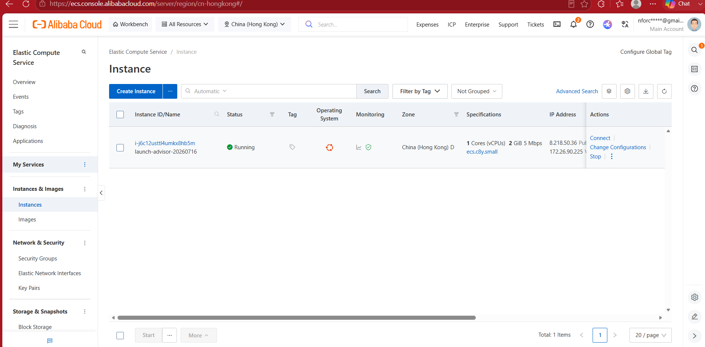

# Alibaba Cloud Deployment Proof

**Required for Devpost submission — this is a pass/fail requirement, refined mid-hackathon after some participants had to go back and re-add it.** Judges check this file directly.

## What's actually required (per the official Devpost update)
Two separate pieces of evidence — a terminal screenshot or a browser screenshot of the web app is **not** sufficient on its own for either of these:

1. **A code file link** showing your project genuinely calls a recognized Qwen Cloud base URL. Ours: [`config.py`](https://github.com/N-Chris/Graub_AI/blob/main/config.py) — `ENDPOINT_URL = "https://dashscope-intl.aliyuncs.com/compatible-mode/v1/chat/completions"`.
2. **A screenshot of the Alibaba Cloud Workbench/ECS console itself** — the "My Resources" overview showing your instance in a **Running** state (region, instance count, status). Not a terminal window, not the web app in a browser — the actual Alibaba Cloud console page. Log into the ECS console, land on the Instances/Overview page, screenshot that.

## Instance Details
- **Service used:** Alibaba Cloud ECS (Elastic Compute Service)
- **Region:** China (Hong Kong)
- **Instance ID:** i-j6c12usttl4umkx8hb5m
- **Instance type:** ecs.c8y.small (1 vCPU, 2 GiB)
- **Public IP:** 8.218.50.36
- **Status:** Running (confirmed live — see screenshot below)

## Proof Link
`https://github.com/N-Chris/Graub_AI/blob/main/config.py` — `ENDPOINT_URL = "https://dashscope-intl.aliyuncs.com/compatible-mode/v1/chat/completions"`

## Steps Taken
1. `git clone https://github.com/N-Chris/Graub_AI.git`
2. `bash setup.sh` (venv + `pip install -r requirements.txt`)
3. Created `.env` directly on the instance with `DASHSCOPE_API_KEY` (never committed to git)
4. Opened inbound TCP 5002 (and 5003 for the API) in the instance's Security Group
5. Ran `python web_ui.py` (via `tmux`, persistent) and `python main.py --client graub_ai` on the instance
6. Confirmed reachable at `http://8.218.50.36:5002/`

## Screenshot

Alibaba Cloud ECS console, Instances overview, China (Hong Kong) region — instance `i-j6c12usttl4umkx8hb5m` shown as **Running**, public IP `8.218.50.36`.

